# Autonomous Quadcopter with Delta Arm Manipulator Based on Motion Capture System

Autonomous Quadcopter with Delta Arm:

  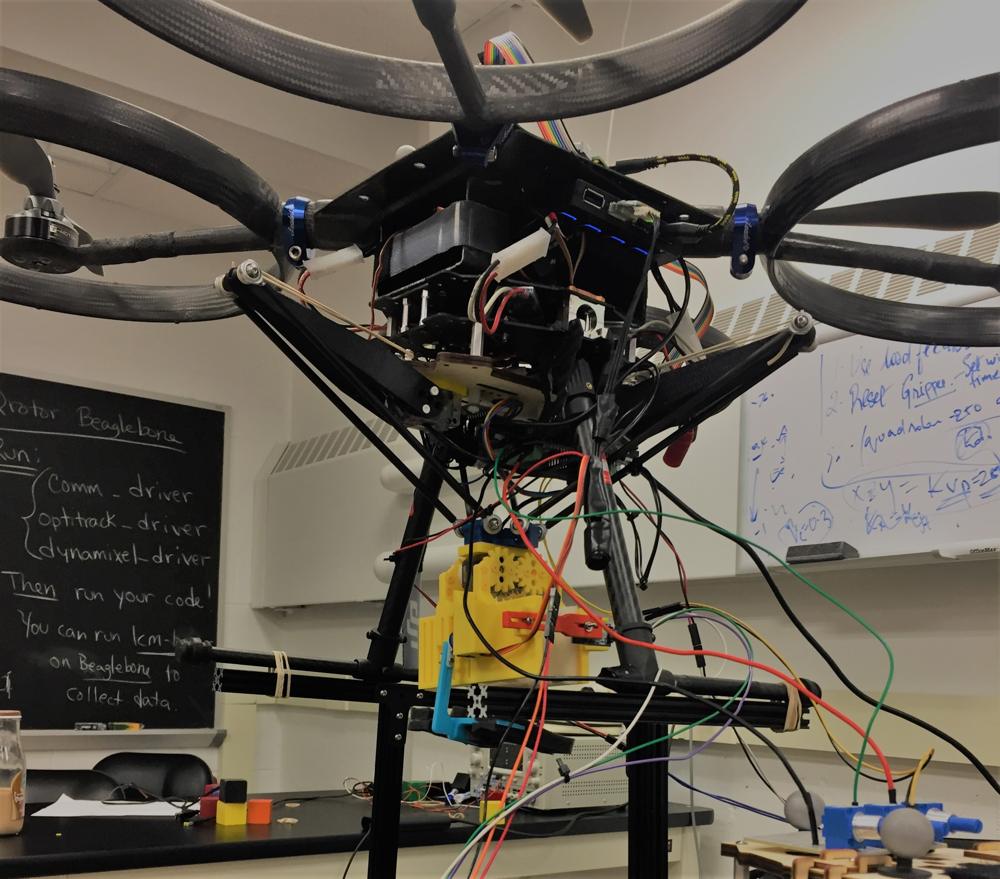

In this project, we implement an autonomous control system for a quadrotor with the ultimate goal to transit to a particular location, pick up a small block, and return it to a destination point and drop the block. To achieve this, the project involves implementation of PID controllers, state machines, signal processing of Optitrack data, mechanical design and 3D-printing skills, as well as delta arm kinematics. 

## Code Structure

****

## Hardware Architecture

Our robot system includes several electrical modules that interface with one another. The subsystems are listed below.

  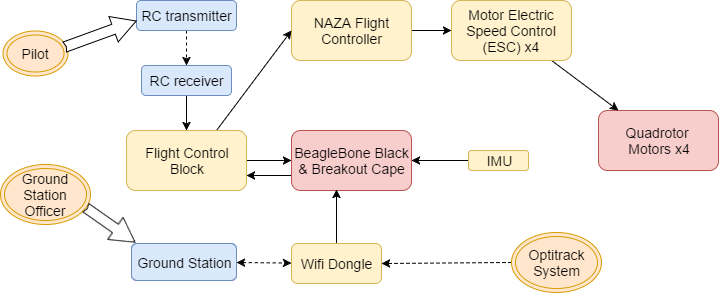

* **BeagleBone Black(BBB)**: The BeagleBone is a low-power, open-source, single-board computer running Debian OS. In this project, because of certain kernel patch problems, we can only use it as a near real-time control system. This system proves sufficient for the implementation of all desired functionalities like the cascade control scheme and data acquisition through IMU interrupts,etc.

* **Breakout Cape**: The Breakout Cape is an extension and interface of the BeagleBone board. It has screw terminals for power, twelve GPIO pins, seven ADC channels, two UARTs, one I2C bus (I2C2), one SPI bus (SPI0) and a second SPI bus that can be run in real time from the programmable real-time units (PRUs) and five 3-pin headers for hobby servos. This is used to primarily isolate and protect the BBB from potentially damaging back EMFs produced by the motors.

* **IMU**: The MPU-9250 (IMU) contains an accelerometer, gyro and magnetometer. In addition, it has a special digital motion processor that can output fused orientation data in the form of quaternions and Tait-Bryan (Euler) angles.

* **NAZA PMU**: The DJI Naza M PMU V2 is a compact power management unit (PMU) that features enhanced BEC functionality and extendable CAN BUS ports.

* **NAZA Controller**: Naza M V2 is a lightweight all-in-one multi-axis control platform with independent PMU and function extension.

* **Arduino Uno**: The Arduino Uno is an open source, real-time microprocessor board from which time-accurate data from an infrared sensor can be obtained to operate the gripper.

* **Wifi Dongle**: We use the Wifi module to establish a communication channel between the laptop and BeagleBone.

* **ESC module**: The electronic speed control module is an electronic circuit used to vary an electric motor's speed and direction. The ESC is used to control propeller motors.

* **Blocks**: The blocks system allows intercepting and retransmitting signals sent from the radio receiver to the flight controller.  This allows us to implement an outer-loop controller with the BeagleBone acting as a full or partial autopilot.

## Gripper Design

Gripper fantasy:

  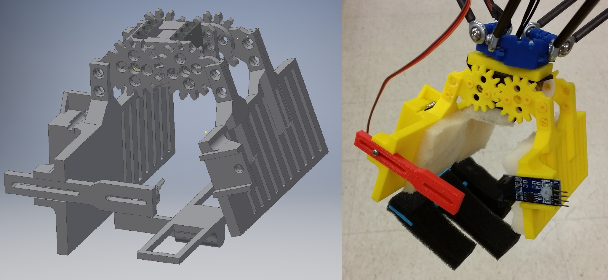

The two-finger, rotation-based gripper utilizes a single XL-320 Dynamixel motor. The fingers measure approximately 11.8 cm in width, enough to adequately hold two blocks at once. This compensates for turbulence experienced by the quadcopter during the pick-up phase, increasing the likelihood of grasping a block.

The design also integrates housing for a Tower Pro micro servo, which actuates a bottom support after grasping a block. This acts as contingency plan in the event that the gripper cannot secure the block after pick-up.

In addition, a slot is provided for an IR sensor on the side of the gripper. The sensor is used to confirm that a block has been picked up. The gripper is equipped with an adjustable rod, which is passed between the beacons of the infrared (IR) sensor, indicating that a block has been picked up. Both the IR sensor and servo motor are controlled by an Arduino Uno microcontroller, fitted onto the landing gear of the quadrotor. 

During testing, the Arduino was connected to the USB hub used by the BeagleBone. While this was a convenient setup, the Arduino was effectively being powered by the BeagleBone, which could not function properly. In order to fully implement our gripper design, we would need to introduce a separate power supply (another battery pack) on the quadrotor. However, with limited time and concerns of over-encumbering the quadcopter, the gripper was simplified by omitting the IR sensor and bottom-support features. Hand-carried delta arm tests demonstrated that the gripper could consistently pick up blocks even without this equipment. In the end, Jerry did not get to play with his new toys for the competition. 

## Delta Arm Manipulator

The quadcopter is equipped with a delta arm and gripper in order to grasp blocks. The arm consists of three struts, each actuated by an XL-320 Dynamixel motor. 

### Forward Kinematics & Inverse Kinematics

For theoretical stuff, please see the [project paper](./misc/flightlab-report.pdf).

## Software Architecture

  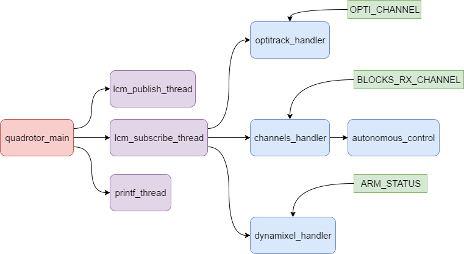

A multi-thread software system is implemented for control of the quadrotor. The main function initializes all configurations and threads, which carry out tasks that include printing the quadrotor's state to the command line (`printf_thread`) and recording LCM logger data (`lcm_publish_thread`). In addition, `lcm_subscribe_thread` is dedicated to subscribing to appropriate LCM channels to acquire information, such as Optitrack, RC transmitter, and Dynamixel motor data. 

When LCM messages are received, corresponding handler functions are called to appropriately process the information. The `channels_handler`, `optitrack_handler`, and `dynamixel_handler` functions are triggered by the `BLOCKS_RX_CHANNEL`, `OPTI_CHANNEL`, and `ARM_STATUS` channels respectively. In `channels_handler`, if the auto mode is switched on (RC transmitter channel[7] > 1500), the quadrotor enters into autonomous mode and runs the `autonomous_control` function. All of the PID controllers and the state machine are implemented in the `autonomous_control` function, which updates the new channel commands and publishes them to the NAZA controller.

## State Machine and Decision Making Architecture

Pick-drop state machine:

  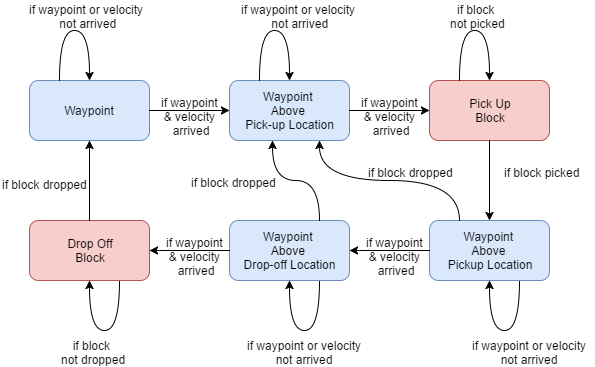

Gripper state machine:

  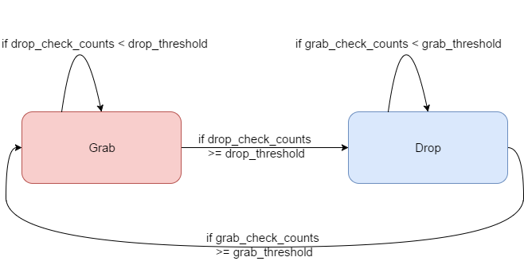

The state of the robot is continuously checked before setting the next state.

For a pick-and-place sequence we include following steps:  (1) Pick-and-place waypoints are set based on the coordinates of the pick-up and drop-off platforms acquired from Optitrack.  (2) The pilot manually takes off, then initiates autonomous control for the BeagleBone. (3) The quadrotor transits to the pick-up site, and (4) the delta arm/gripper picks up the block. (5) Next, the quadrotor heads to the drop-off receptacle for block release, and (6) the gripper releases the block at the drop-off location. (7) Finally, the quadrotor returns to its initial position. The sequence is then repeated to place multiple blocks in the receptacle.

* **waypoint and velocity check**: Ensure that the current pose reaches the target location and the quadrotor's velocity remains within a certain error range.

* **grab and drop check**: Only when the gripper's angle position and torque are in specified ranges can we consider the block grabbed or dropped. Between the pick-up state and drop-off state, if the block is detected as dropped, the quadrotor returns to the pick-up location to re-pick the block.

## Control System Design

We use the BeagleBone Black (BBB) for position and velocity control, as well as the NAZA controller to convert the BBB commands into differential thrust control outputs for each rotor. Initially a remote control is used for taking off, and once the quadrotor is stabilized, autonomy mode is activated. Then, the BBB takes control, transmitting the desired PWM signals to the NAZA based on the task at hand and the feedback from Optitrack.  

  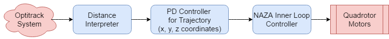

For the control system, a two-layer scheme is implemented. The first layer is a distance interpreter, which computes a desired velocity for the quadrotor based on the distance between its current position and waypoint. The second layer is a trajectory controller, which ensures that the quadrotor follows the trajectory set by the state machine while moving at the desired velocity. Output of the second layer serves as input to the NAZA's inner loop controller, which ultimately drives the quadrotor motors.

Directly processing the pose and velocity data from the Optitrack often introduces unnecessary noise into our system, resulting in random oscillations of the quadrotor. The noisy data is more noticeable when fewer cameras are used for position tracking or the quadcopter is out of range for a subset of the cameras. To acquire more stable readings, we apply a low-pass filter to the Optitrack data stream, which reduced unexpected movements in the quadcopter during flight. 

## Task Design and Performance

In order to evaluate the performance of the quadrotor/delta arm design, we use several test cases to fly the quadrotor in autonomous mode. During such flight tests, the robot is attached to two tethers as a safety precaution. 

### Waypoint Hold

The first task of the competition involves the quadrotor hovering at a single position for an appreciable period of time. During the competition, the robot was subjected to disturbances, which included pulling it by its safety tethers in various directions (left, right, up, down, forward and backward). Our outer-loop control scheme proved effective, with minimal signs of drift or oscillations while hovering in place. In addition, the quadcopter recovered quickly when pulled in any direction and maintained its position.

3D Plot of Quadrotor Center for waypoint hold with external disturbances:

  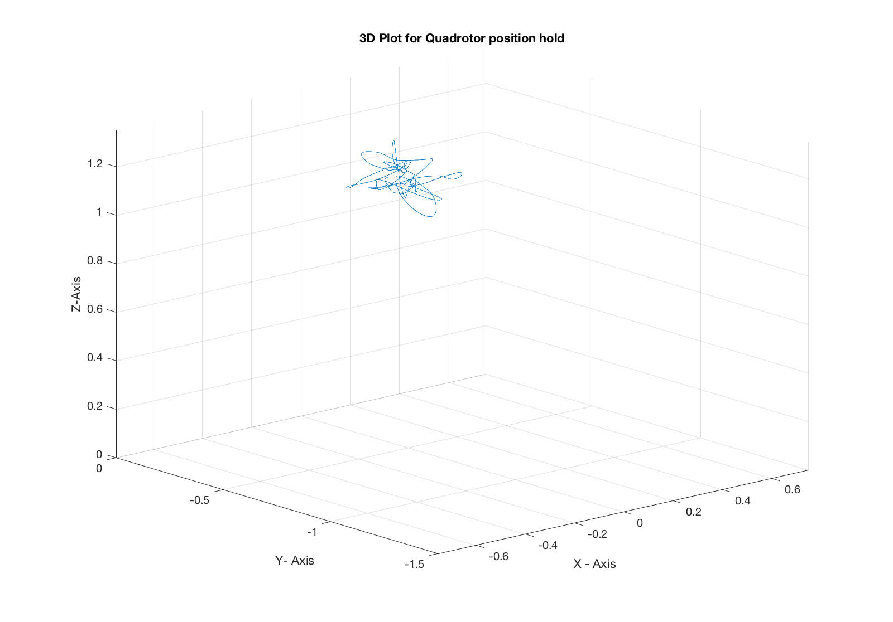

### Waypoint Transit

The quadrotor is also programmed to traverse to one waypoint, hover briefly, then return to its initial position. For this task, the waypoint was set at the xy-coordinate (1.5 m,-1.5 m) with respect to the origin defined in the Optitrack space. This position was near the boundary of the Optitrack's range of vision. Therefore, it was essential that the quadrotor not overshoot its destination, which would result in loss of feedback. Two options for addressing this issue are tuning PID gains for the outer-loop controller or reducing the velocity of the robot when traveling between waypoints. Due to the time constraints of the competition, we decided to reduce the quadcopter's velocity, which resulted in successful completion of the task. 

### Block Pick-and-Place

Quadrotor pick and drop task:

  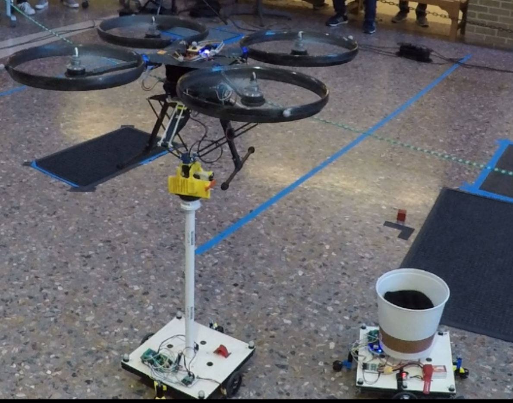

Once waypoint hold and transit were successfully performed, the quadrotor was programmed to pick up a block from one location and drop it at another destination. As it hovers above the pick-up platform, it computes the distance of the block relative to the end-effector's position. When this distance is within a certain threshold, the delta arm is commanded to reach the block for pick-up. 

The quadcopter was able to pick and place multiple blocks during the competition. In general our outer-loop controller allowed the robot to hover steadily above the pick-up platform while attempting to grasp the block.

Multi-rounds of time sequence plot for pick and drop task:

  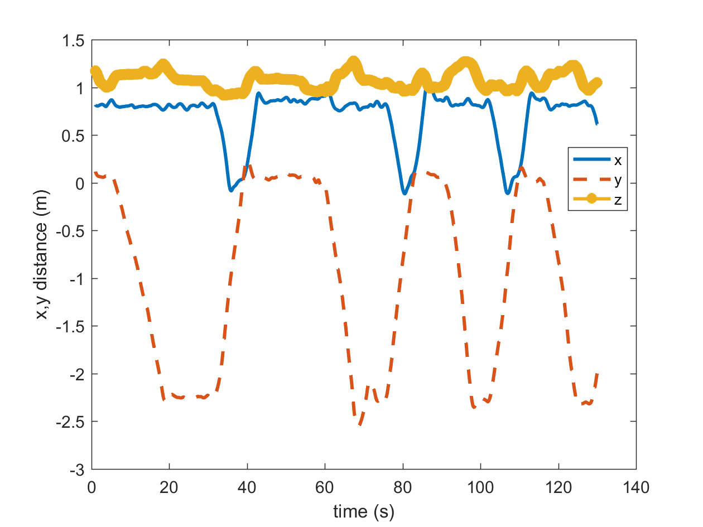

The figure above demonstrates this stability, showing the xyz-position of the robot over the course of the task. The changes in position are also relatively periodic. The first two peaks do appear wider, meaning it took a longer time for the quadrotor to adjust its pose during both the pick and drop phases. 

With the quadcopter lower to the ground during pick-up, more turbulence due to increased air pressure under the robot was experienced (known as the ground effect in aerodynamics). This can be gleaned from the small perturbations in the z-component. Fortunately, the gripper compensated for this instability due to its wide fingers that provided a large surface area for catching the block. 

2D Plot of (y-axis) Center of quadrotor for pick place task with external disturbances:

  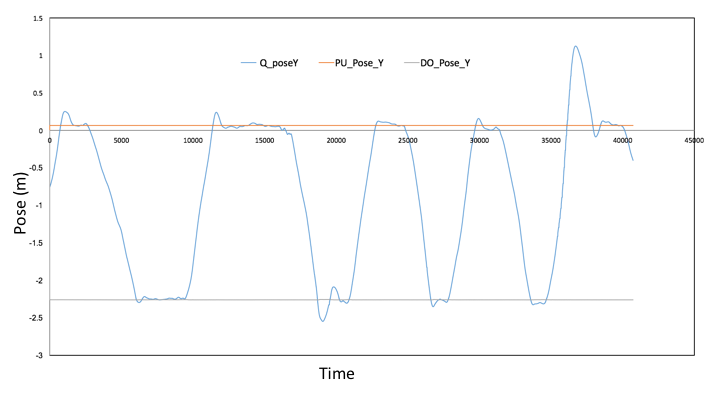

The figure above displays only the y-component of the robot for the entire duration of the pick-and-place task. We can see that each time the quadrotor reaches its destination, it overshoots slightly (< 5%), resulting in a small spike at the edge of each peak in the plot. For the large spike observed on the final peak, the quadrotor overshot its destination and struggled to recover during the pick-up phase. This may be attributed to low battery power when the fifth block was attempted since the battery's indicator light was flashing rapidly at the time. It is also possible that the quadrotor briefly lost communication with the Optitrack. If the robot travels too far past the target and approaches the boundary of sight for the Optitrack, it may be delayed in stabilizing. 

Despite our overall success in this task, the gripper had a tendency to slightly overshoot when picking up the block, causing it to partially grip the block's platform. On the other hand, there were cases when the quadcopter was too high in altitude and could not reach the block. This is because we didn't measure the height offset in test area, and in order to avoid adjusting quadcopter pose for a very long time, we give the state machine a relatively large error check threshold (5cm). To solve this, we can refine the robot's decision of a valid pick-up distance by tuning offset and threshold parameters for the distance between the gripper and block. 

One round of trajectory for pick and drop task:

  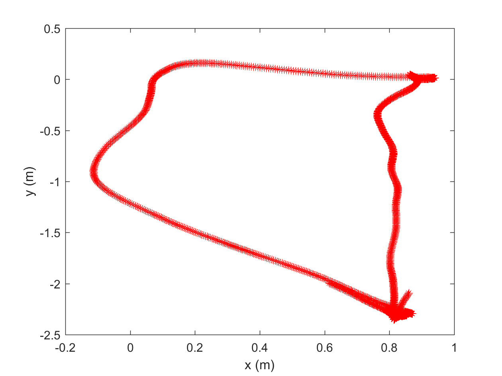

Multi-rounds of trajectory for pick and drop task:

  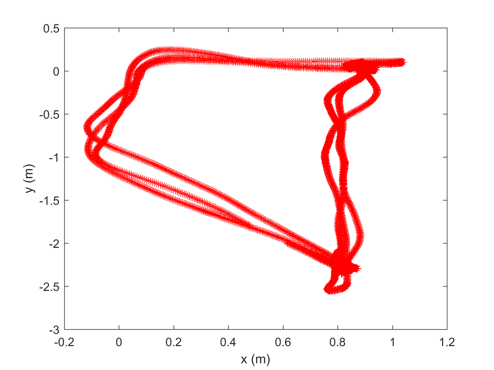

 The pick location  is roughly at (0.85 m, 0 m), the drop location at (0.8 m, -2.35 m), and we set intermediate waypoints between the drop-off step and the next pick-up step. After four iterations of the task, the quadrotor overall shows high accuracy in following the same commanded trajectory. It can be seen, however, that the robot is particularly accurate when moving between the pick-up and drop-off stations. This is because in our design, we give a relatively small position error threshold for the quadcopter to follow between these two waypoints but allow larger thresholds (10cm~15cm) for the other waypoints. It is only crucial for the quadrotor to be exact in its position as it approaches the pick-up and drop-off locations. 
 

### Chasing a Mobile Drop-off Station

State machine for pick and drop task when chasing mobile station:

  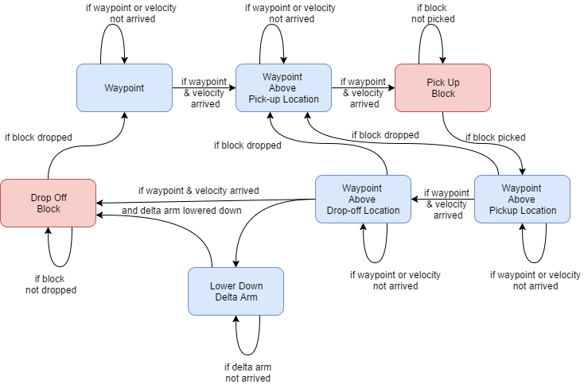

In this task, the goal is again to pick-and-place a block, but the drop-off station is now mobile and commanded remotely by a ground station operator. To account for the moving receptacle, we implement both location and velocity checks of the quadcopter. The location check verifies that the location error of the quadrotor and the current waypoint (the pick-up or drop-off station) are within a certain range. Furthermore, the velocity check ensures that the quadrotor matches the velocity of the drop-off station. 

However, during the competition, we did not execute our velocity check function due to limited time in tuning velocity-check function parameters and error thresholds.

Despite relying only on the location check feature, the quadrotor was successfully able to drop one block into the mobile station. For the failed attempts, the quadrotor was in the process of releasing a block when the receptacle changed directions. Had the velocity check function been utilized, the quadcopter would have responded to the change and maintained its position above the station. 

The **Chase a Mobile Drop-off Station** state machine differs from **Static pick-up and drop-off location** in that the delta arm is lowered down to close the distance between the block and the drop-off station. In previous trials, when the arm was not lowered, the dropped block took too long to reach the moving target. The block's trajectory could also be altered by air currents when dropped from a higher distance. Lowering the delta arm resulted in a more accurate drop-off performance during the competition. An alternative is to decrease the quadcopter's altitude, but this would only amplify the ground effect and cause more instability.

## Acknowledgment

This project is based on ROB550 in University of Michigan.

Code contributors: Zihang Wei (wzih@umich.edu), Prashin Santosh Sharma (prashinr@umich.edu), Eric Tsai (ericct@umich.edu), The Great Jerry (our gripper name).

We would like to thank Prof. Ella Atkins, course instructor, for scientific guidance, Dr. Peter gaskell, lab instructor, for providing us with the proper equipment set and guidance throughout the experimentation process as well as lab sessions.

## License

autonomous-quadrotor-with-manipulator is distributed under the [MIT license](./LICENSE).